**IBM Cloud Tutorial**

## Lab Setup Instructions

1. Setup a GitHub account:** [https://github.com/](https://github.com/)
2. Set up a new IBM Cloud account**
   
   2.1. Open a web browser and navigate to [https://cloud.ibm.com](https://cloud.ibm.com)
   
   2.2. Click **Create an IBM Cloud account**.
 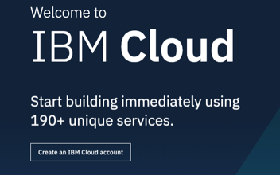

    2.3. Complete the following form with your contact information. Email address, name, country, and a password are required. When you&#39;re done, click **Create Account**.
    
    2.4. You will receive an email with a button to confirm your account and complete the IBM Cloud registration process.
    
    2.5. Complete the steps in the email to confirm your account. After confirmation, a web page will show a link to log in for the first time.
      
    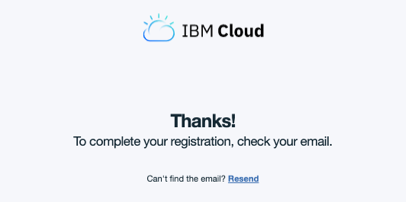
   
   Follow the link and sign in with your email and password. You will go through a series of one-time setup dialogs.
  
  
   2.6. Accept the terms.
  
    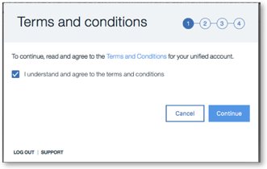

    2.7. Enter the name for your IBM Cloud organization. Use the suggested options or create one of your own. The organization name must be unique across IBM Cloud.
    
    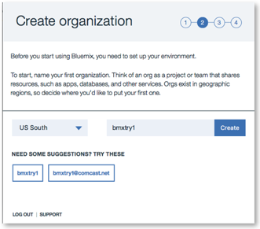

    2.8. Create your first space. Again, use the suggested options or enter your own space name. Space names do not need to be unique across IBM Cloud.
    
    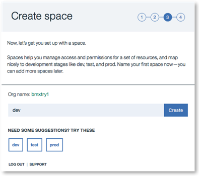
  
    2.9. In the Summary page, click I&#39;m **Ready** to continue to IBM Cloud.
 
    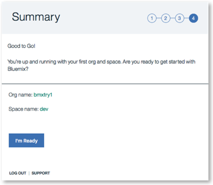

    Next, you&#39;ll create a Kubernetes Cluster. Now, you&#39;re ready to create your first IBM Cloud application.
    
    
3. **Create a Kubernetes Cluster:** [https://cloud.ibm.com/docs/containers/cs\_tutorials.html#cs\_cluster\_tutorial](https://cloud.ibm.com/docs/containers/cs_tutorials.html#cs_cluster_tutorial)
4. **Install Kubectl command line**: [https://kubernetes.io/docs/tasks/tools/install-kubectl/](https://kubernetes.io/docs/tasks/tools/install-kubectl/)
5. **Install Docker**:

    **Windows**: [https://hub.docker.com/editions/community/docker-ce-desktop-windows](https://hub.docker.com/editions/community/docker-ce-desktop-windows)

    **Mac**: [https://docs.docker.com/docker-for-mac/install/](https://docs.docker.com/docker-for-mac/install/)

6. **Minikube can also be installed for local kubernetes should users not have access to IBM Cloud however you won&#39;t be able to use IBM Cloud functions.**
[https://kubernetes.io/docs/setup/minikube/](https://kubernetes.io/docs/setup/minikube/)

7. See tutorials session below for how to use all the tools installed/created.

## Tutorials

1. Git repo([https://github.com/aadenira/JobSearch](https://github.com/aadenira/JobSearch)): You can use this repo directly during the tutorials or fork It into your own repository. To fork:
    1. Click on the fork icon as shown below and follow the next steps.

        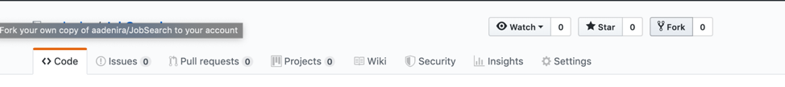

2. Create a Kubernetes Cluster: We will be creating a Kubernetes cluster before proceeding, this is required to ensure the cluster is completed by the time it is needed, to create one, follow item 2 in setup instructions above or follow instructions below:
    1. Click on the menu item(highlighted with the red box below) on your IBM dashboard and select Kubernetes from the list of items:
      
       
      
       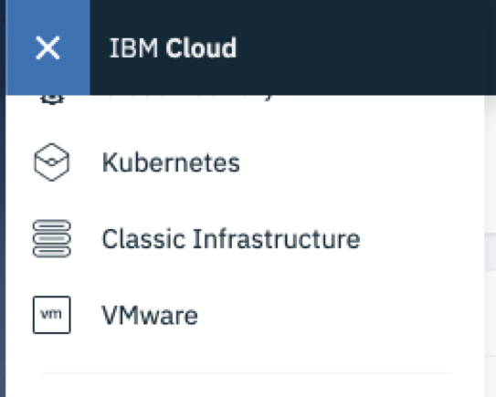

    2. Create a cluster using the button highlighted. By default, every account is allowed a cluster for 30 days, setup your cluster as shown below, values should be changed accordingly:
        
         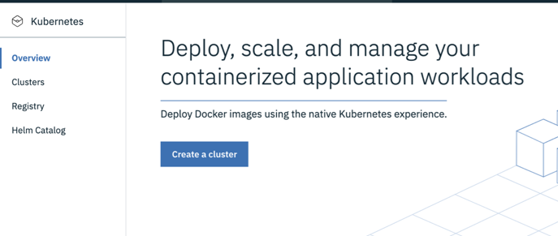
         
         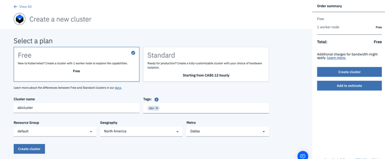
         
         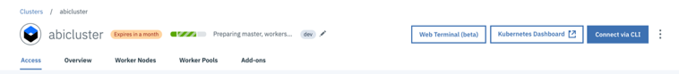
         
         
3. Setup IBM Functions: As discussed in the slides included, IBM Functions is a serverless platform that allows us to write single unit of code often referred to as functions, we will now begin by creating a function and expose it as an API/Web Action.
      1. Click on the menu item(highlighted with the red box below) on your IBM dashboard and select functions from the list of items:

           
          
           

      2. On the IBM Cloud functions dashboard, you can change your data center to a preferred location or choose the default, then click on start creating 
          
          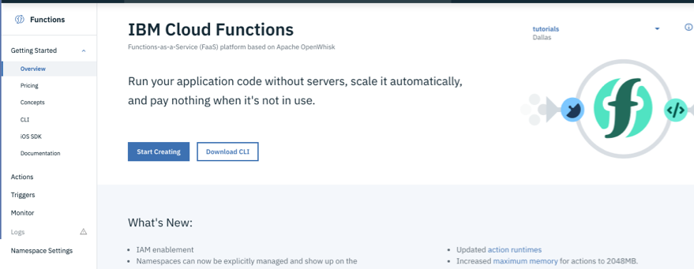
          
      3. To start creating, IBM Cloud function comes with a list of templates, users can also create from scratch, In this tutorial, we will be creating from scratch. To do this, click on Create Action:

          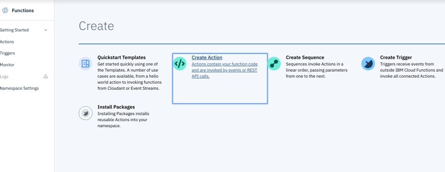

      4. Choose the parameters as shown below and click on Create, a different name can be used, we will be using python 3 as our runtime:
      
          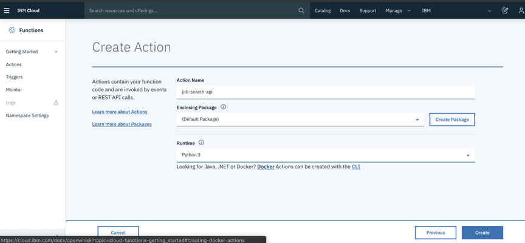

      5. Get the sample python template from [https://github.com/aadenira/JobSearch/blob/master/cloudfunctionsapi.py](https://github.com/aadenira/JobSearch/blob/master/cloudfunctionsapi.py). This should also be in your git repository if you forked the above repo.
  
      6. Delete previous content and paste the content from the above repo in your functions edit panel and save. Line 21 of the content can be changed to your own GitHub data location if you forked earlier.

          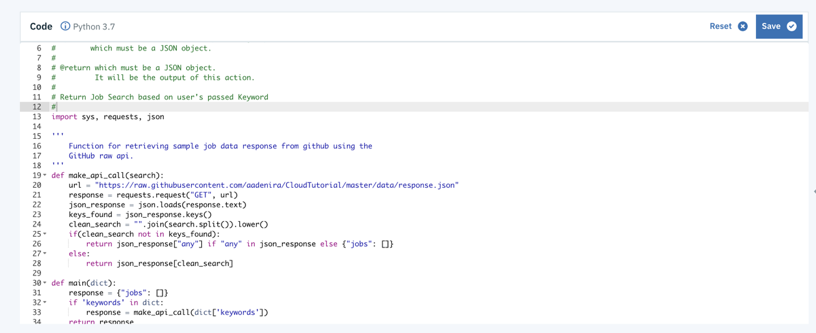

      7. To get the Raw URL of the response.json file, go to your repository and navigate to the **data/response.json** file. Click on the Raw button to get the url as shown in Image 2 below.

          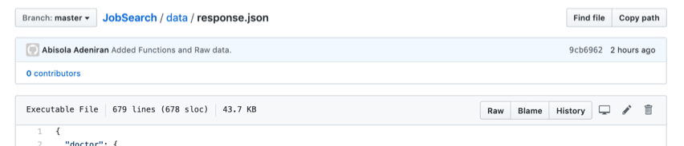
     
          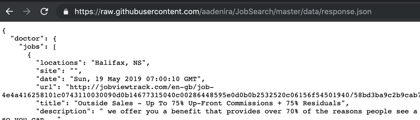

      8. After saving, you should see an invoke button, click on the button to see a sample output.

          

          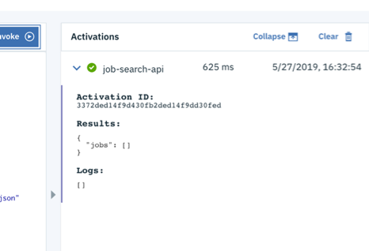

      9. At this point, the sample output produces an empty json object on the **jobs** field, this is because we have not passed any parameters to it. The function expects a **keywords** parameter to return your desired output, to pass an input parameter, click on the **Change Input** button, pass in a JSON object as seen in the 2nd image below, click on apply and invoke again to see new results

          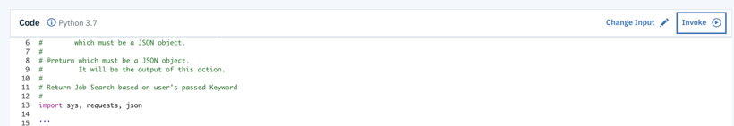
      
          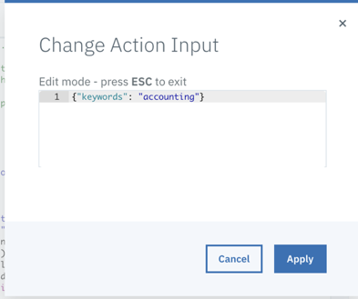

      10. Your results should now look like the below, note that the results are hard coded to return only **software engineer, accountant, doctor and a default result** for any other fields.
      
          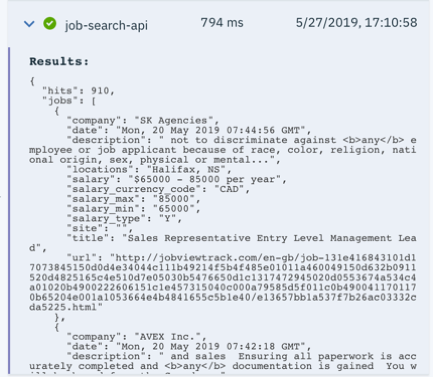
 

      11. Expose as an API: On the sidebar, click on endpoints to enable the action as an API.

          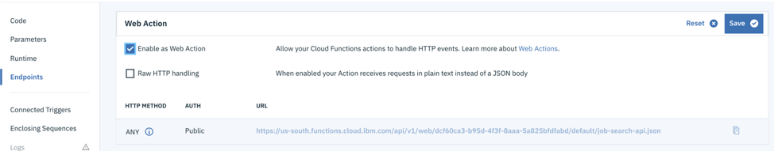
          
          a. Copy the URL created above(ends with .json) and replace in your github repo if forked. Changes can be made on your repo on line 13 of file **src/app/service/apicalls.service.spec.ts.**
           
          b. Save this changes then proceed to next steps.

4. Setup Container Registry Namespace
    
    1. Click on the menu item(highlighted with the red box below) on your IBM dashboard and select Kubernetes from the list of items.
    2. Click on Registry on the left Sidebar.
    
          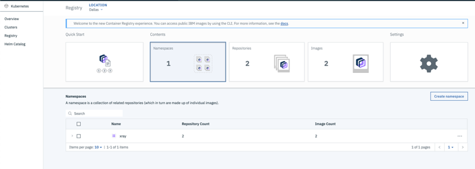

    3. Click on Namespaces card and click on Create namespace button as shown above, A popup like the below should appear, type in a unique name then Create.

          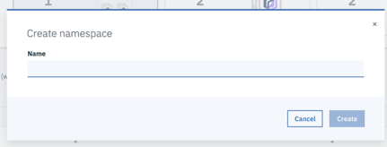

5. Setup DevOps Toolchain
  
    1. Before we build a toolchain, it is important to check the status of our Kubernetes cluster, it should be in a **Normal** state, if state is still Pending, we should hold off and monitor it before proceeding.

       
    2. Click on the menu item(highlighted with the red box below) on your IBM dashboard and select DevOps from the list of items:

       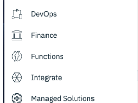

    3. Click on **Create a Toolchain**

       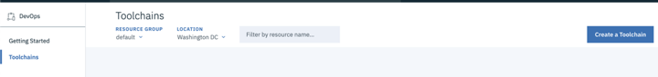

    4. Choose a template from the list of cards, for the tutorials, select **Deploy a Kubernetes app**.
       
       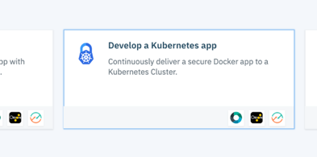

    5. Fill in the form as required, it is important to change the Source repository URL to either the one you forked or the one provided above.

        
        
        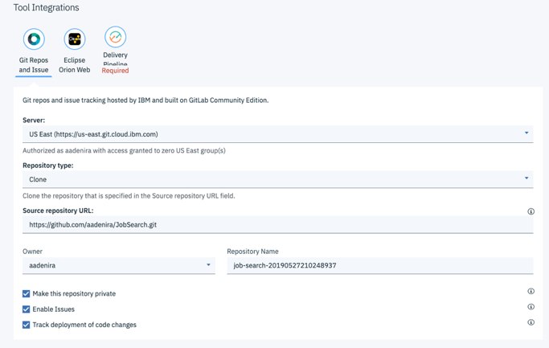

    6. Click on Delivery Pipeline to connect your Kubernetes cluster and Container registry namespace created above. Notes:
        1.  Create an IBM Cloud API Key by clicking on the **Create** button.
        2. You can either use the default **App name** r create a new one.
        3. Your Cluster namespace ( **3 below** ), should match that in the deployment.yml file in git, in this case **default**.

          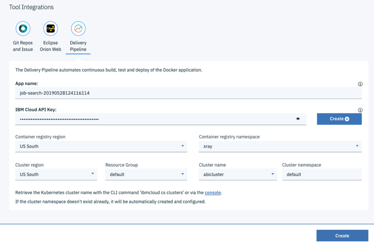
    
    7. After filling in the necessary information, click on the Create button(Highlighted box 4 above). You should now see a dashboard like the image below.

       

    8. After configuration is complete, Various cards are seen as shown above. The cards represent the following:
        1. **1** – **THINK** (Issues Card), this shows you any issue in the GitHub repo that has been created.
        2. **2** – **CODE** (Git Card), this takes you to the git repository created for you by IBM.
        3. **3** – **DELIVER** (Delivery Pipeline Card), this shows you the various stages that has been setup for a Kubernetes deployment.
        4. **4** – **CODE** (Eclipse Orion Web IDE), this takes you to a web IDE for editing and saving your code. The git symbol is seen on the sidebar for pushing your code.
  
    9. Click on **DELIVER** (Delivery  Pipeline card) to see the various deployment stages. The below image shows you the status of each stage based on the template we selected.

       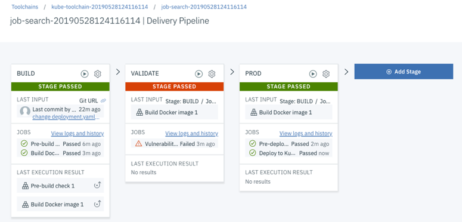

    10. Once all stages have passed, lets access our application&#39;s URL, go to your Kubernetes Dashboard by clicking on **Kubernetes Dashboard** as highlighted below.

        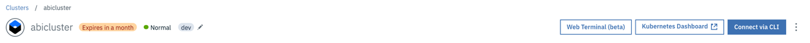

    11. You should see something like the below, if not refresh to get the below image. This image shows you how a Kubernetes dashboard looks like, You can see your **Deployments** , **Pods, Services, e.t.c**.

        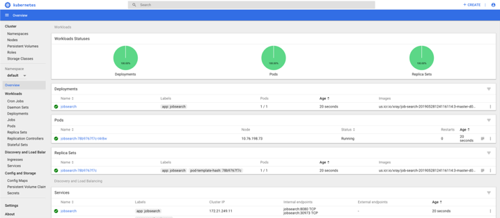

    12. Go to the services section and select **jobsearch** , Under details, get the port for the application, this can be found under Internal endpoints, typically starts with a **3** (see below image). Save this port number.

        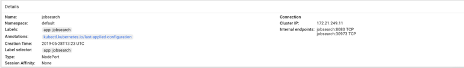

    13. Go back to your IBM Cloud dashboard and select Kubernetes in the menu bar,  click on the Worker Nodes tab as shown below. Copy the public IP address.

        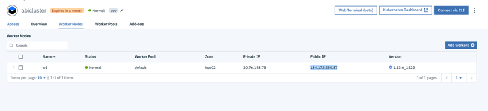

    14. Paste the public address and the port number saved in **L** above e.g.  [http://184.172.250.87:30973](http://184.172.250.87:30973)and paste in a Browser. You should see the below image. Type in any of the following values to get an output like image 2 below: **Software Engineer, Accountant, Doctor, any**.

        
        
        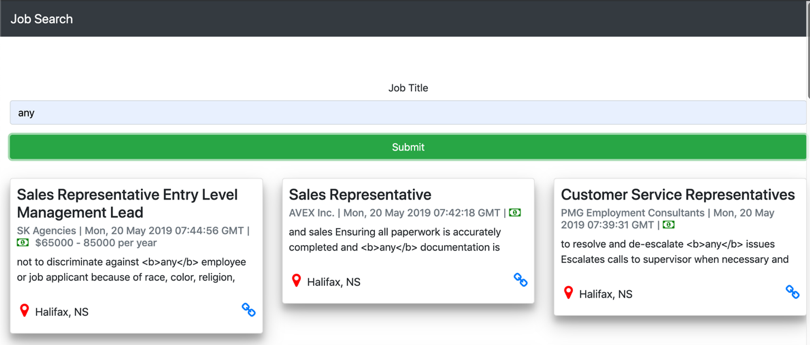

    15. This concludes the tutorials, at this point, we have worked with **Containers, Kubernetes, Serverless/Functions As A Service, Automation and Continuous Delivery.** See references for more information

## References:

### Open Source Tools

1. Automation/Continuous Delivery: [https://jenkins.io/](https://jenkins.io/), [https://www.ansible.com/](https://www.ansible.com/)
2. FAAS(Functions As a Service): [https://openwhisk.apache.org/](https://openwhisk.apache.org/)
3. Version Control: [https://subversion.apache.org/](https://subversion.apache.org/)

### Other Tools(Not Opensource but free access)

1. Containers: [https://www.docker.com/get-started](https://www.docker.com/get-started)
2. Kubernetes: [https://kubernetes.io/docs/home/](https://kubernetes.io/docs/home/)
3. Version Control: [https://github.com/](https://github.com/) , [https://bitbucket.org/](https://bitbucket.org/)
4. FAAS: [https://cloud.ibm.com/openwhisk/](https://cloud.ibm.com/openwhisk/)
5. Project Management: [https://trello.com/](https://trello.com/), [https://www.atlassian.com/software/jira](https://www.atlassian.com/software/jira)
6. Automation/Continuous Delivery: [https://circleci.com/](https://circleci.com/)
